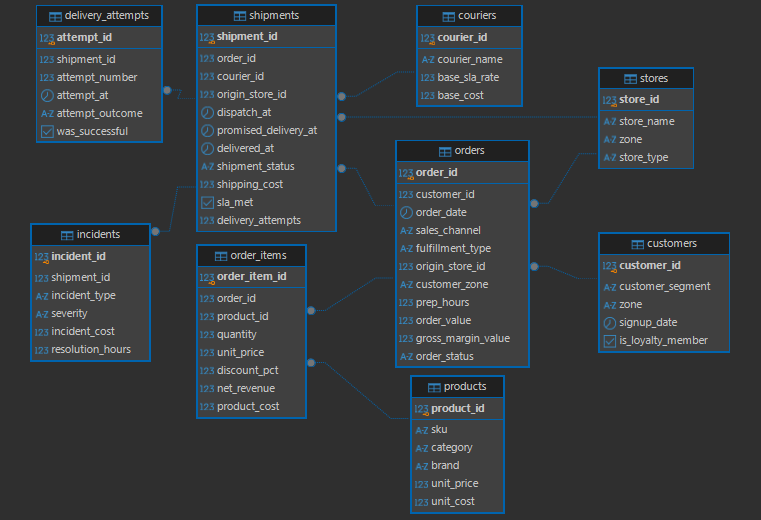

# 🚚 UrbanDrop — SQL Analytics para Operaciones y Última Milla

**PostgreSQL · SQL · DBeaver · Operations Analytics · Logistics · Last Mile**
## 🔗 Case Study
👉 [Ver análisis completo en Notion](https://frequent-replace-a38.notion.site/UrbanDrop-SQL-Analytics-para-Operaciones-y-ltima-Milla-3ea8671270358016a556cfce83cae5b2)


Sobre el proyecto

UrbanDrop es una empresa ficticia argentina de moda, zapatillas y accesorios que opera mediante e-commerce y tiendas físicas, combinando entregas desde un centro de distribución, Ship from Store y retiro en tienda.

El objetivo del proyecto es utilizar **SQL para analizar la operación de última milla** y responder una pregunta de negocio:

> **¿Dónde se generan las demoras y sobrecostos de última milla, y qué cambios permitirían mejorar el nivel de servicio?**

El análisis estudia SLA, costos, atrasos, couriers, zonas, puntos de origen, intentos de entrega, incidentes y modalidades de fulfillment.


## 🗃️ Dataset

Dataset sintético diseñado para representar una operación omnicanal de última milla en CABA y GBA.

- 12.000 pedidos
- 10.640 envíos
- 12.425 intentos de entrega
- 953 incidentes
- 2.500 clientes
- 220 productos
- 10 tiendas / centro de distribución
- 5 couriers
- Período: enero 2025 — agosto 2026

### Tablas

`customers`  
`products`  
`stores`  
`couriers`  
`orders`  
`order_items`  
`shipments`  
`delivery_attempts`  
`incidents`

---

## 🧩 Modelo de datos

Las nueve tablas permiten relacionar información comercial y operativa desde el pedido hasta la entrega final.

El modelo conecta:

**Clientes → Pedidos → Envíos → Couriers → Intentos de entrega → Incidentes**

junto con información de productos y puntos de origen.



---

## 🔎 Enfoque analítico

El análisis avanza progresivamente desde una visión general hacia segmentos operativos específicos:

**Performance general → Courier → Zona → Courier × Zona → Origen → Atrasos → Incidentes → Fulfillment → Evolución temporal**

### KPIs principales

- Cumplimiento de SLA (%)
- Costo promedio por envío
- Entrega en primer intento (%)
- Atraso promedio
- Incidentes cada 100 envíos

---

## 📊 Principales hallazgos

### 1. El problema no son solamente los reintentos

El **85,49%** de los envíos se completa en el primer intento, pero solamente el **34,73%** cumple con el SLA prometido.

Esto indica que los reintentos, por sí solos, no explican el deterioro del nivel de servicio.

---

### 2. Existe una fuerte brecha geográfica

**Zona Oeste GBA**

- SLA: **14,81%**
- Costo promedio: **$2.356,21**
- Atraso promedio: **26,58 h**

**CABA Norte**

- SLA: **52,18%**
- Costo promedio: **$1.990,79**
- Atraso promedio: **16,25 h**

Zona Oeste combina el menor cumplimiento de SLA con el mayor costo promedio.

Por lo tanto, un mayor costo logístico no necesariamente se traduce en un mejor nivel de servicio.

---

### 3. Courier × Zona revela los hotspots operativos

La performance cambia considerablemente al analizar conjuntamente proveedor y geografía.

🔴 **MotoYA × Zona Oeste**

- SLA: **2,58%**
- Atraso promedio: **32,66 h**
- Incidentes: **16,62 cada 100 envíos**

🟢 **UrbanDrop Flex × CABA Centro**

- SLA: **67,19%**
- Atraso promedio: **14,38 h**

Esto demuestra que evaluar couriers únicamente mediante su performance agregada puede ocultar diferencias operativas relevantes.

---

### 4. Frecuencia de incidentes ≠ impacto económico

**Demora operativa** es el incidente más frecuente, con **418 casos**.

Sin embargo:

- Pedido incompleto → ~$636.299 de costo total
- Paquete dañado → ~$606.199 de costo total
- Dirección incorrecta → 32,12 h de resolución promedio

La priorización de problemas debe considerar frecuencia, impacto económico y tiempo de resolución.

---

### 5. Ship from Store no presenta una ventaja operativa global

| Métrica | Centro de Distribución | Ship from Store |
|---|---:|---:|
| SLA | 36,97% | 29,88% |
| Costo promedio | $2.177,49 | $2.178,10 |
| Atraso promedio | 20,11 h | 22,57 h |

Ship from Store presenta prácticamente el mismo costo promedio, pero menor SLA y mayores atrasos.

Los resultados no justifican eliminar la modalidad, pero sí revisar dónde realmente genera valor.

---

## 📈 Evolución temporal

El análisis mensual no muestra una mejora sostenida del nivel de servicio.

El SLA presenta recuperaciones y retrocesos durante el período, mientras que el costo promedio se mantiene relativamente estable.

Para analizar la evolución se utilizaron **CTEs y `LAG()`**, comparando cada período con el mes inmediatamente anterior.

---

## 💡 Recomendaciones

1. **Optimizar la asignación Courier × Zona** utilizando SLA histórico, costo, atrasos e incidentes.

2. **Priorizar Zona Oeste y Zona Sur**, investigando capacidad, rutas, promesas de entrega y puntos de origen.

3. **Analizar MotoYA y Ruta24 de manera segmentada**, evitando evaluarlos solamente por su performance agregada.

4. **Reevaluar Ship from Store por tienda y zona** antes de ampliar su utilización.

5. **Priorizar incidentes por impacto**, combinando frecuencia, costo total, tiempo de resolución y efecto sobre SLA.

---

## 🛠️ SQL aplicado

Durante el proyecto se utilizaron:

- `INNER JOIN` / `LEFT JOIN`
- `GROUP BY`
- `HAVING`
- `CASE WHEN`
- `FILTER`
- `COALESCE`
- `NULLIF`
- CTEs
- `LAG()`
- `RANK()`
- Funciones de fecha y timestamps
- Agregaciones y segmentación multidimensional

---

## 📂 Estructura del repositorio

```text
urbandrop-sql-analytics/
│
├── README.md
├── data/
├── docs/
│   ├── er_diagram.png
│   └── data_dictionary.csv
├── schema/
│   └── 01_schema.sql
└── sql/
    ├── 00_quality_checks.sql
    ├── 01_Performance_Operativa_General.sql
    ├── 02_Performance_Courier.sql
    ├── 03_Courier_Zona.sql
    ├── 04_Performance_General_Zona.sql
    ├── 05_Performance_Origen.sql
    ├── 06_Atrasos_por_Zona.sql
    ├── 07_Courier_Zona_Atrasos.sql
    ├── 08_Impacto_Incidentes.sql
    ├── 09_Incidentes_Courier_Zona.sql
    ├── 10_Performance_Fulfillment.sql
    ├── 11_Evolucion_Mensual_Performance.sql
    └── 12_Ranking_Performance_Operativa.sql
```

---

## 🎯 Habilidades demostradas

**SQL & Data**

PostgreSQL · DBeaver · SQL · Data Analysis

**Operations Analytics**

SLA · análisis de costos · segmentación operacional · análisis de incidentes · performance por proveedor · análisis geográfico · evolución temporal

**Business Analytics**

Identificación de hotspots · priorización · trade-off costo/servicio · recomendaciones operativas · toma de decisiones basada en datos

---

## 📌 Conclusión

UrbanDrop permitió transformar una operación de última milla con múltiples variables en un diagnóstico accionable.

El análisis muestra que el bajo nivel de servicio no puede explicarse por un único factor: **courier, geografía, origen, incidentes y modalidad de fulfillment interactúan de forma diferente según el contexto operativo**.

Más que identificar simplemente “el peor courier”, el objetivo fue detectar qué combinaciones operativas generan mayor riesgo y dónde existen oportunidades para reasignar recursos y mejorar el servicio.

---

## ⚠️ Disclaimer

UrbanDrop es un proyecto ficticio desarrollado con fines de portfolio.

**Todos los datos utilizados son sintéticos y no representan información de una empresa real.**
